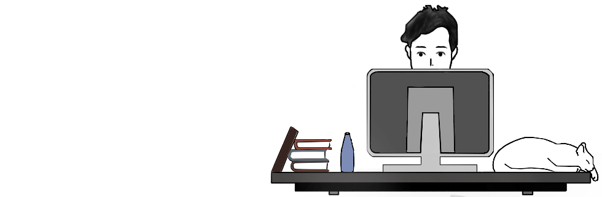

	

	 
	 
		My name is Yuri, my specialty is Full Stack Web development but I intend to improve myself in other area such as AI, computer vision
		Machine Learning and others. 
	 
	 

	
 
 

 

	
📍 From Brazil 
 
 	
👨🏻‍💻 Student of Systems Analysis and Development 
 
	
📫 Send me a message. I will certainly answer you and let be friends! 

 
 
 
 
	
## Reach me out 

 
	&nbsp;&nbsp;&nbsp;&nbsp;&nbsp;&nbsp;&nbsp;&nbsp;&nbsp;
	
	&nbsp;&nbsp;&nbsp;&nbsp;&nbsp;&nbsp;&nbsp;&nbsp;&nbsp;
	
	&nbsp;&nbsp;&nbsp;&nbsp;&nbsp;&nbsp;&nbsp;&nbsp;&nbsp;
	<a href="https://www.linkedin.com/in/yuri-peixinho-6a943b206/">
	

	
	
	
	
	
	
## Skills	
 

	

	
	
	

	
	
	

